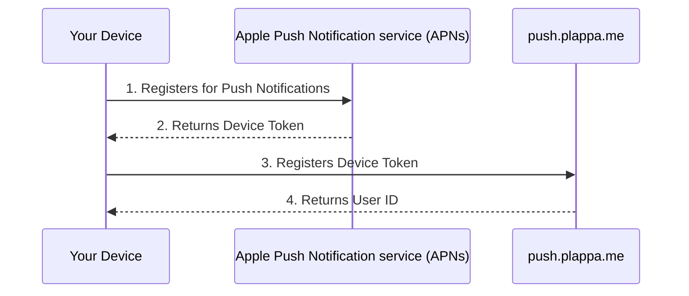
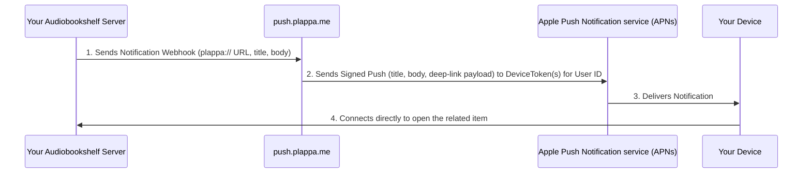

# plappaPush

This repository holds the server-side implementation of the [plappa](https://github.com/LeoKlaus/plappa) push notification service.
Below, you'll find a graphic illustrating how it works.

## How does this work?

### Registering for Notifications

No information regarding you or your server is transmitted to the plappa push server during registration.
The only information the push server stores is the absolute minimum it needs to function:
- The randomly generated user ID
- The device tokens for all devices you register

**No other data about you, your device or your server is stored!**

### Sending/Receiving Notifications

Your Audiobookshelf server sends a notification webhook to push.plappa.me containing a `plappa://` URL identifying which user, and, if you use plappa with more than one Audiobookshelf server, which server via an `instanceId` along with a title and body. The service relays that title, body, and a small deep-link payload to your registered devices via APNs; none of it is stored. No audiobook content, files, or other metadata ever passes through the push server. Once you tap the notification, plappa connects directly to your Audiobookshelf server to open the related item.

## Security

The entire server implementation is built around keeping the amount of stored data at an absolute minimum.
If you find any security issues with push.plappa.me, please disclose them at support@plappa.me.

## Licensing

The Push service uses the following two libraries under their respective licenses:
- https://github.com/ramsey/uuid
- https://github.com/edamov/pushok

As of now, plappaPush should be considered [source-available](https://en.wikipedia.org/wiki/Source-available_software). While you can see, download and fork this code, it is not licensed under any open source license.

If you want to use this implementation for a project or your own app, please let me know!
